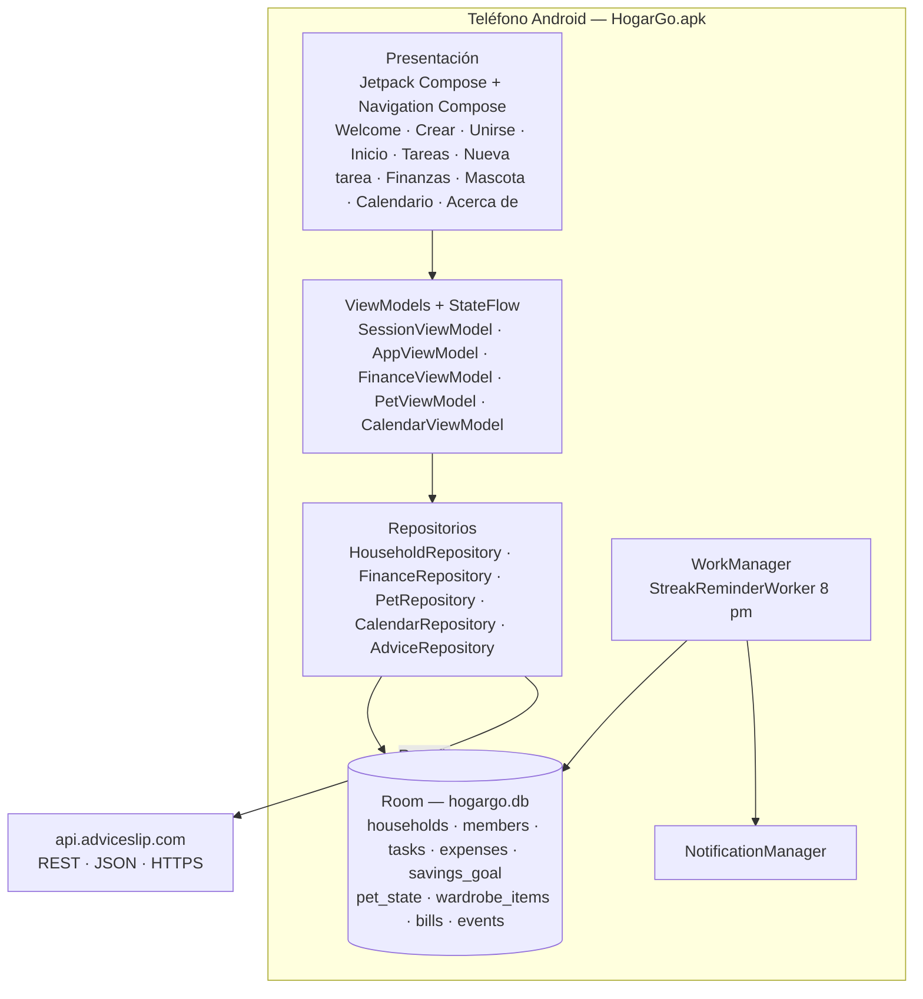

# 🦊 HogarGo

**Tareas del hogar y finanzas familiares convertidas en un juego en equipo.**
Cada familia crea su propio *hogar* con un código de invitación; sus integrantes se reparten tareas, llevan las cuentas claras, cuidan juntos a **Zori** (el zorro mascota) y alcanzan sus metas de ahorro.

Microproyecto de la electiva **Desarrollo de Aplicaciones Móviles** — Departamento de Telemática, Universidad del Cauca.

## ✨ Funcionalidades

| Módulo | Qué hace |
|---|---|
| **Hogar y sesión** | Crear un hogar o unirse con un código de 6 caracteres. El administrador acepta o rechaza solicitudes, cambia el nombre del hogar y elimina integrantes. Inicio de sesión con nombre o con un *usuario de recuperación*, que también sirve para recuperar el código del hogar. Perfil, cambio de nombre y salir del hogar (el rol de admin pasa al integrante más antiguo). |
| **Inicio** | Saludo con el nombre del usuario, racha diaria, próxima tarea, metas de ahorro, Zori con la ropa que lleva puesta, consejo del día desde una API en línea y accesos rápidos (nueva tarea, gasto, evento y menú *Más*). |
| **Tareas** | Crear tareas con categoría, hora, recompensa en monedas y responsable (integrante del hogar u “otra persona”). Marcarlas como hechas alimenta la racha y las monedas. |
| **Finanzas** | Gastos por categoría con selector de fecha, resumen **del mes actual** (total, promedio y desglose) y **varias metas de ahorro** con aportes por meta. |
| **Mascota (Zori)** | Felicidad y saciedad que bajan con el tiempo, alimentar y jugar con tiempo de espera, niveles. Las **monedas** ganadas en tareas se gastan en la tienda del armario (bufanda, pelota, lentes, monopatín) y Zori **viste** lo que se equipa. |
| **Calendario** | Cuadrícula mensual con marcas por día (eventos, facturas pendientes y tareas completadas). Al tocar un día se ve su detalle y se puede agregar un evento en esa fecha. Facturas con vencimiento y estado de pago. |
| **Notificaciones** | Un trabajo diario (WorkManager, 8:00 pm) avisa si la racha está en riesgo. |
| **Acerca de** | Descripción de la app y créditos del equipo. |

Disponible en **español** e **inglés**, con **modo claro y oscuro**.

## 📱 Pantallas (10)

Bienvenida · Crear hogar · Unirse a un hogar · Inicio · Tareas · Nueva tarea · Finanzas · Mascota · Calendario · Acerca de
(más los diálogos de perfil, recuperación de código, nuevo gasto, nuevo evento y metas).

La barra inferior tiene **Tareas · Finanzas · Inicio · Mascota · Calendario**, con Inicio al centro.

## 🧱 Tecnología

- **Kotlin** + **Jetpack Compose** (Material 3)
- **Navigation Compose** con transiciones animadas entre pestañas y pantallas de detalle
- **ViewModel + StateFlow** para el estado de cada pantalla
- **Room** (SQLite) como base de datos local, con migraciones (versión 9)
- **Retrofit + Gson** para el servicio en línea [Advice Slip API](https://api.adviceslip.com/)
- **WorkManager** + notificaciones locales
- **KSP** como procesador de anotaciones; `minSdk 31`, `targetSdk 37`

## 🏗️ Arquitectura

Arquitectura por capas, con un único flujo de datos hacia la interfaz: `Compose → ViewModel → Repository → Room / API`.
Todo dato familiar (tareas, gastos, metas, mascota, calendario) pertenece a un hogar (`householdId`), de modo que un hogar nunca lee ni escribe los datos de otro.



El diagrama de despliegue editable está en [`docs/arquitectura-hogargo.drawio`](docs/arquitectura-hogargo.drawio) (se abre en [draw.io](https://app.diagrams.net)).

```
app/src/main/java/com/hogargo/app/
├── data/
│   ├── local/          Entidades, DAOs, Converters y HogarGoDatabase (Room)
│   ├── household/      Crear/unirse/iniciar sesión, recuperación, SessionStore
│   ├── finance/ pet/ calendar/   Repositorios por funcionalidad
│   ├── network/        Retrofit (Advice Slip API)
│   └── notification/   Notificación y worker de la racha
└── ui/
    ├── navigation/     NavHost, rutas, barra inferior y transiciones
    ├── household/      Bienvenida, crear, unirse, perfil, recuperación
    ├── home/ tasks/ newtask/ finance/ pet/ calendar/ about/
    └── theme/          Colores, tipografía y tema Material 3
```

## 🎨 Criterios de diseño aplicados

1. **Consistencia.** Un único tema Material 3 (paleta naranja del zorro, tipografía propia) en todas las pantallas, barra de navegación fija y componentes reutilizados: el mismo diálogo de *Nuevo gasto* se usa en Inicio y Finanzas, y el de *Nuevo evento* en Inicio y Calendario.
2. **Visibilidad del estado y retroalimentación.** Barras de progreso en metas de ahorro y en felicidad/saciedad de Zori, la racha siempre visible, tiempos de espera explícitos (“Disponible en X min”), mensajes de error junto a cada campo y estados vacíos que invitan a actuar.
3. **Prevención de errores y control del usuario.** Validación de montos y nombres, confirmación antes de acciones destructivas (eliminar una meta, eliminar a un integrante, salir del hogar), botones deshabilitados cuando una acción no es posible (comprar sin monedas suficientes) y permisos de administrador comprobados en la base de datos.
4. **Reconocimiento antes que memorización.** Íconos con etiqueta en la barra inferior, selectores de fecha y hora en lugar de texto libre y categorías con ícono.
5. **Motivación (gamificación).** Rachas, monedas, niveles y una mascota que reacciona al cuidado del hogar.

## ▶️ Cómo ejecutarlo

1. Abrir el proyecto con **Android Studio** (JDK 17).
2. Sincronizar Gradle y ejecutar en un teléfono o emulador con Android 12 (API 31) o superior.
3. Para el consejo del día se necesita conexión a internet; sin ella se muestra un texto de respaldo.

```bash
./gradlew assembleDebug
```

## 👥 Equipo

| Integrante | Rama | Responsabilidad |
|---|---|---|
| **Nelson Rodrigo López Vidales** | `Nelson` | Finanzas, Mascota, Calendario, integración, navegación y animaciones |
| **Jhonatan Palacios Gomez** | `JhonatanPG` | Tareas, Inicio, racha y notificaciones, consejos en línea (API) |
| **Dana Isabella Romero Núñez** | `create-join-home` | Inicio de sesión y creación del hogar |

## ⚠️ Limitaciones conocidas

- El acceso se hace con el nombre del integrante y el código del hogar, sin contraseña.
- Los datos viven en el dispositivo (Room): no se sincronizan entre teléfonos.
- Una instalación con una versión de base de datos anterior a la 6 se reinicia al actualizar (fase de desarrollo).
